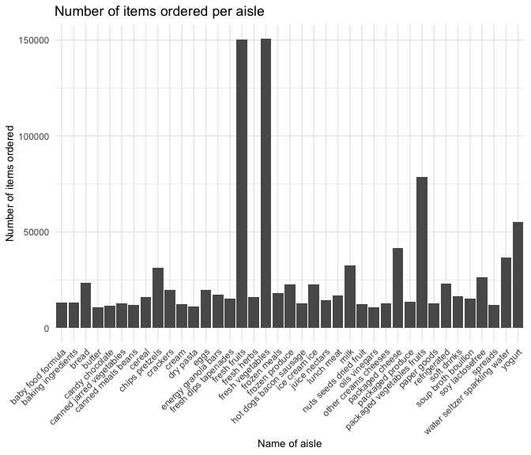

p8105\_hw3\_lk2761
================
Lorraine Kwok
October 8, 2019

## Problem 1

We are using Instacart data that will be loaded in through the
p8105.datasets.

``` r
library(p8105.datasets) 
data("instacart")
```

This code chunk produces a new dataframe that shows the number of
distinct aisles and the number of items ordered from each.

``` r
num_aisles_df = 
  instacart %>%
  count(aisle) %>%
  rename(.data = ., num_items_ordered = n) %>%
  arrange(desc(num_items_ordered)) 
```

There are a total of 134 aisles represented in the Instacart dataset.
The aisles selling “fresh vegatables” (150609), “fresh fruits” (150473),
“packaged vegetables fruits” (78493) and “yogurt” (55240).

The following code chunk filters through the dataset to include the
aisles that sold more than 10000 items and creates a plot showing the
number of items ordered in each aisle.

``` r
num_aisles_df %>%
  filter(.data = ., num_items_ordered > 10000) %>%
  ggplot() + 
  geom_col(aes(x = aisle, y = num_items_ordered)) +
  theme_minimal() +
  theme(axis.title = element_text(size = 10),
    axis.text.x = element_text(angle = 45, hjust = 1)) +
  labs(title = "Number of items ordered per aisle", 
       x = "Name of aisle",
       y = "Number of items ordered") 
```



This code chunk creates a table that shows the three most popular items
in each of the aisles: baking ingredients, dog food care and packaged
vegetables fruits.

``` r
num_pop_items_df =
  instacart %>%
  group_by(aisle) %>%
  select(.data = ., aisle, product_name) %>%
  filter(.data = ., aisle == "baking ingredients" | aisle == "dog food care" | aisle == "packaged vegetables fruits") %>%
  count(product_name) %>%
  rename(.data = ., num_products = n) %>%
  arrange(desc(num_products)) %>%
  top_n(3) %>%
  pivot_wider(
    names_from = "aisle",
    values_from = "num_products"
  ) 
```

    ## Selecting by num_products

``` r
knitr::kable(num_pop_items_df,
             caption = "Table 1. Three Most Popular Items Sold in the Packaged Vegetables Fruits, Baking Ingredients and Dog Food Care Aisles",
             col.names = c("Name of Product",
             "Packaged Vegetables Fruits Aisle",
             "Baking Ingredients Aisle",
             "Dog Food Care Aisle"))
```

| Name of Product                               | Packaged Vegetables Fruits Aisle | Baking Ingredients Aisle | Dog Food Care Aisle |
| :-------------------------------------------- | -------------------------------: | -----------------------: | ------------------: |
| Organic Baby Spinach                          |                             9784 |                       NA |                  NA |
| Organic Raspberries                           |                             5546 |                       NA |                  NA |
| Organic Blueberries                           |                             4966 |                       NA |                  NA |
| Light Brown Sugar                             |                               NA |                      499 |                  NA |
| Pure Baking Soda                              |                               NA |                      387 |                  NA |
| Cane Sugar                                    |                               NA |                      336 |                  NA |
| Snack Sticks Chicken & Rice Recipe Dog Treats |                               NA |                       NA |                  30 |
| Organix Chicken & Brown Rice Recipe           |                               NA |                       NA |                  28 |
| Small Dog Biscuits                            |                               NA |                       NA |                  26 |

Table 1. Three Most Popular Items Sold in the Packaged Vegetables
Fruits, Baking Ingredients and Dog Food Care Aisles

Table 1 shows the three most popular items sold in three aisles:
packaged vegetables and fruits, baking ingredients and dog food care.
The top item sold in the packaged vegetables and fruits aisle was
organic baby spinach (9784), light brown sugar (499) in the baking
ingredients aisle and snack sticks chicken and rice recipe dog treats
(30) in the dog food care aisle.

The following code chunk creates a new dataframe based on the Instacart
dataset. A new variable has been added to show the mean hour of the day
at which Pink Lady Apples and Coffee Ice Cream were ordered. The code
also generates a table that showing this information.

``` r
mean_hr_day_df = 
  instacart %>%
  select(.data = ., product_name, order_dow, order_hour_of_day) %>%
  mutate(.data = ., 
         order_dow = recode(order_dow, 
                            `0` = "Sunday",
                            `1` = "Monday",
                            `2` = "Tuesday", 
                            `3` = "Wednesday",
                            `4` = "Thursday", 
                            `5` = "Friday", 
                            `6` = "Saturday")) %>%
  filter(.data = ., product_name == "Pink Lady Apple" | product_name == "Coffee Ice Cream") %>%
  arrange(product_name, order_dow) %>%
  group_by(product_name, order_dow) %>%
  summarize(
    mean_hr_day = round(mean(order_hour_of_day), 2)
  ) %>%
  pivot_wider(
    names_from = "order_dow",
    values_from = "mean_hr_day"
  ) %>%
  select(.data = ., Sunday, Monday, Tuesday, Wednesday, Thursday, Friday, Saturday)
```

    ## Adding missing grouping variables: `product_name`

``` r
knitr::kable(mean_hr_day_df,
             caption = "Table 2. Mean hour items were sold per day", 
             col.names = c("Name of Product", 
                           "Sunday",
                           "Monday",
                           "Tuesday",
                           "Wednesday",
                           "Thursday",
                           "Friday",
                           "Saturday"))
```

| Name of Product  | Sunday | Monday | Tuesday | Wednesday | Thursday | Friday | Saturday |
| :--------------- | -----: | -----: | ------: | --------: | -------: | -----: | -------: |
| Coffee Ice Cream |  13.77 |  14.32 |   15.38 |     15.32 |    15.22 |  12.26 |    13.83 |
| Pink Lady Apple  |  14.40 |  14.20 |   13.20 |      8.00 |    11.00 |  16.00 |    13.00 |

Table 2. Mean hour items were sold per day

Table 2 shows the mean hour of the day (in military time) at which Pink
Lady Apples and Coffee Ice Cream were ordered on each day of the week.
Based on the table, Coffee Ice Cream was mainly ordered in the afternoon
and early evening. Similarly, Pink Lady Apples were also ordered in the
afternoon and early evening with the exception of Wednesday and Thursday
when they were ordered in the morning at a mean hour of 8:00AM and
11:00AM, respectively.

## Problem 2

Problem 2 uses the BRFSS dataset loaded in from the p8105.datasets. The
following code chunk tidies up the data by filtering through to only
focus on the “Overall Health” topic and to reorder the factor levels of
the response variable.

``` r
library(p8105.datasets)
data("brfss_smart2010")

brfss_smart2010_tidy =
  brfss_smart2010 %>%
  janitor::clean_names() %>%
  filter(.data = ., 
         topic == "Overall Health",
         response == "Excellent" | response == "Fair" | response == "Good" | response == "Poor" | response == "Very good") %>% 
  mutate(.data = ., 
         state_name = state.name[match(locationabbr, state.abb)],
         response = factor(response, levels = c("Poor", "Fair", "Good", "Very good", "Excellent"))) %>%
  rename(.data = ., state_abbr = locationabbr, state_county = locationdesc) %>%
  filter(.data = ., topic == "Overall Health") %>%
  select(.data = ., year, state_abbr, state_name, state_county, topic, response, data_value)
```

The following data creates two new dataframes showing data for all
states in 2002 and in 2010.

``` r
num_states_2002 = 
  brfss_smart2010_tidy %>%
  janitor::clean_names() %>%
  mutate(.data = . ,) %>%
  filter(.data = ., year == "2002") %>%
  count(state_name) %>%
  rename(.data = ., num_locations = n) %>%
  filter(.data = ., num_locations >= 7) 

num_states_2010 = 
  brfss_smart2010_tidy %>%
  janitor::clean_names() %>%
  filter(.data = ., year == "2010") %>%
  count(state_name) %>%
  rename(.data = ., num_locations = n) %>%
  filter(.data = ., num_locations >= 7) 
```

In 2002, the following states Arizona, Colorado, Connecticut, Delaware,
Florida, Georgia, Hawaii, Idaho, Illinois, Indiana, Kansas, Louisiana,
Maine, Maryland, Massachusetts, Michigan, Minnesota, Missouri, Nebraska,
Nevada, New Hampshire, New Jersey, New York, North Carolina, Ohio,
Oklahoma, Oregon, Pennsylvania, Rhode Island, South Carolina, South
Dakota, Tennessee, Texas, Utah, Vermont, Washington were observed in 7
or more locations. In 2010, the following states Alabama, Arizona,
Arkansas, California, Colorado, Connecticut, Delaware, Florida, Georgia,
Hawaii, Idaho, Illinois, Indiana, Iowa, Kansas, Louisiana, Maine,
Maryland, Massachusetts, Michigan, Minnesota, Mississippi, Missouri,
Montana, Nebraska, Nevada, New Hampshire, New Jersey, New Mexico, New
York, North Carolina, North Dakota, Ohio, Oklahoma, Oregon,
Pennsylvania, Rhode Island, South Carolina, South Dakota, Tennessee,
Texas, Utah, Vermont, Washington, Wyoming were observed in 7 or more
locations.

The following code chunk creates a new dataset that only includes
“Excellent” as responses to the “Overall Health” topic. It also
includes a new variable that averages the data values for each state.
The second section of code creates a “spaghetti” plot that shows the
average data values across years for each state.

``` r
excellent_df = 
  brfss_smart2010_tidy %>%
  janitor::clean_names() %>%
  filter(.data = ., response == "Excellent") %>%
  group_by(state_abbr) %>%
  mutate(.data = . ,
         avg_data_value = mean(data_value, na.rm = TRUE)) %>%
  select(.data = . , year, state_name, avg_data_value)
```

    ## Adding missing grouping variables: `state_abbr`

``` r
ggplot(excellent_df, aes(group = state_name, x = year, y = avg_data_value, color = state_name)) + 
  geom_line() +
  theme_minimal() +
  theme(axis.title = element_text(size = 6)) +
  labs(title = "Distribution of the average value of excellent responses in states, 2002-2010", 
       x = "Year",
       y = "Average value of excellent responses") +
  scale_color_hue(name = "State") 
```


This code creates a new dataset that consists of NY state data values
and responses to the “Overall Health” topic for 2006 and 2010. The data
are presented in a two-panel plot.

``` r
ny_state_data =
  brfss_smart2010_tidy %>%
  janitor::clean_names() %>%
  filter(.data = ., state_abbr == "NY", year == "2006" | year == "2010") %>%
  arrange(year)

ggplot(ny_state_data, aes(group = state_county, x = response, y = data_value, color = state_county)) + 
  geom_line() +
  facet_grid(~year) +
  theme_minimal() +
  theme(axis.title = element_text(size = 10),
    axis.text.x = element_text(angle = 45, hjust = 1)) +
  labs(title = "Distribution of health responses in New York counties, 2006 and 2010", 
       x = "Health Response",
       y = "Proportion of health response") +
  scale_color_hue(name = "County in NY") +
  theme(legend.position = "bottom",
        legend.title = element_text(size = 6),
        legend.text = element_text(size = 5))
```


## Problem 3

This problem utilizes accelerometer data collected on a 63 year-old man
over the course of five weeks.

The following code chunk imports the csv file and tidies up the data.

``` r
accel_data = 
  read.csv("./data/accel_data.csv") %>%
  rename(.data = ., num_of_day = day_id) %>%
  mutate(.data = ., 
         weekday_weekend = ifelse(day == "Monday" | day == "Tuesday" | day == "Wednesday" | day == "Thursday" | day == "Friday", "weekday", "weekend")) %>%
  select(.data = ., week, num_of_day, day, weekday_weekend, everything())
```

This dataset consists of five weeks of accelerometer data collected on a
63 year old man with BMI 25. There are 1444 variables and 35
observations in this dataset. Of the 1444 variables in this dataset,
1440 variables represent the activity counts for each minute of a
24-hour day that starts as midnight. The *week* variable represents the
week number out of five weeks, the *num\_of\_day* represents the day
number out of 35 days, the *day* variable represents the name of the day
of the week and the *weekday\_weekend* variable denotes whether the day
is a weekday or is over the weekend.

The following code chunk creates a new dataframe based on the
accel\_data dataset. This new dataframe consists of a new variable that
sums up the total daily activity for each of the 35 days. The code also
creates a table that shows the number of data, the name of the day of
the week as well as the total number of activity counts for each day.

``` r
accel_data_tot =
  accel_data %>%
  mutate(.data = .,
         total_daily_activity = rowSums(accel_data[,5:1444], na.rm = TRUE)) %>%
  select(.data = ., num_of_day, day, total_daily_activity)

knitr::kable(accel_data_tot,
             caption = "Table 3. Total number of activity counts per day for 35 days",
             col.names = c("Number of Day (out of 35 days)",
                           "Day",
                           "Total number of activity counts"))
```

| Number of Day (out of 35 days) | Day       | Total number of activity counts |
| -----------------------------: | :-------- | ------------------------------: |
|                              1 | Friday    |                       480542.62 |
|                              2 | Monday    |                        78828.07 |
|                              3 | Saturday  |                       376254.00 |
|                              4 | Sunday    |                       631105.00 |
|                              5 | Thursday  |                       355923.64 |
|                              6 | Tuesday   |                       307094.24 |
|                              7 | Wednesday |                       340115.01 |
|                              8 | Friday    |                       568839.00 |
|                              9 | Monday    |                       295431.00 |
|                             10 | Saturday  |                       607175.00 |
|                             11 | Sunday    |                       422018.00 |
|                             12 | Thursday  |                       474048.00 |
|                             13 | Tuesday   |                       423245.00 |
|                             14 | Wednesday |                       440962.00 |
|                             15 | Friday    |                       467420.00 |
|                             16 | Monday    |                       685910.00 |
|                             17 | Saturday  |                       382928.00 |
|                             18 | Sunday    |                       467052.00 |
|                             19 | Thursday  |                       371230.00 |
|                             20 | Tuesday   |                       381507.00 |
|                             21 | Wednesday |                       468869.00 |
|                             22 | Friday    |                       154049.00 |
|                             23 | Monday    |                       409450.00 |
|                             24 | Saturday  |                         1440.00 |
|                             25 | Sunday    |                       260617.00 |
|                             26 | Thursday  |                       340291.00 |
|                             27 | Tuesday   |                       319568.00 |
|                             28 | Wednesday |                       434460.00 |
|                             29 | Friday    |                       620860.00 |
|                             30 | Monday    |                       389080.00 |
|                             31 | Saturday  |                         1440.00 |
|                             32 | Sunday    |                       138421.00 |
|                             33 | Thursday  |                       549658.00 |
|                             34 | Tuesday   |                       367824.00 |
|                             35 | Wednesday |                       445366.00 |

Table 3. Total number of activity counts per day for 35 days

Looking at the table, it is a bit difficult to assess overall trends as
the activity counts fluctuate both within each of the five weeks and
between them. Based on this table, in Week 1, the patient had higher
levels of physical activity counts on Friday (480542.62 counts) and
Sunday (631105.00 counts). The lowest counts of activity were on Day 24
and Day 31 (both were Saturdays) where the counts were only 1440 for
each. The highest number of activity counts was for Day 16, which was a
Monday, with a total of 685910 activity counts.

The following code chunk creates a new dataframe that consists of
information on the week, day, and a single column capturing all
activity.\* instead of having them as individual columns. We then
generate a line plot showing the 24-hour activity time course for each
day.

``` r
accel_data_long = 
  pivot_longer(accel_data,
               activity.1:activity.1440, 
               names_to = "activity_min",
               values_to = "activity_count") %>%
  mutate(.data = ., activity_count = round(activity_count, 2)) 

ggplot(accel_data_long, aes(x = activity_count, y = num_of_day)) + 
  geom_line(aes(color = day)) +
  theme_minimal() +
  scale_x_continuous(
    breaks = c(0, 500, 1000, 1500, 2000, 2500, 3000, 3500, 4000, 4500, 5000, 5500, 6000, 6500, 7000, 7500, 8000, 8500), 
    labels = c("0", "500", "1000", "1500", "2000", "2500", "3000", "3500", "4000", "4500", "5000", "5500", "6000", "6500", "7000", "7500", "8000", "8500")) +
  scale_y_continuous(
    breaks = c(0, 5, 10, 15, 20, 25, 30, 35), 
    labels = c("0", "5", "10", "15", "20", "25", "30", "35")) +
  theme(legend.position = "bottom") + 
  theme(axis.title = element_text(size = 10),
        axis.text.x = element_text(angle = 90, hjust = 1)) +
  labs(title = "24-hour activity time course for each day", 
       x = "Activity in minutes per day",
       y = "Number of day (out of 35 days)") +
  scale_color_hue(name = "Day of the week") 
```


Looking at the plot for the 24-hour activity time course for each day,
out of a total of 35 days, it appears that the majority of daily
activity counts for the 63 year-old male patient were between 0 activity
counts and 2500 activity counts.
